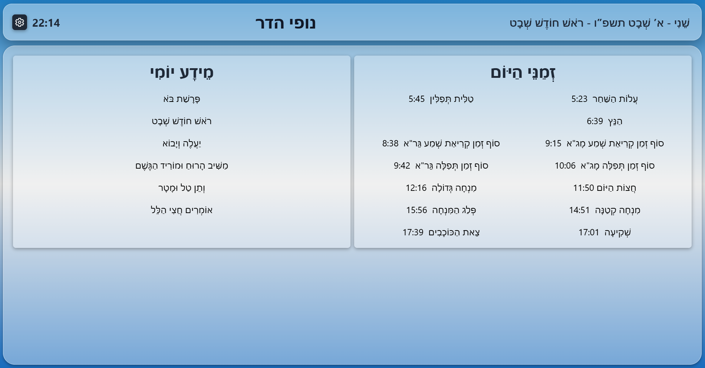
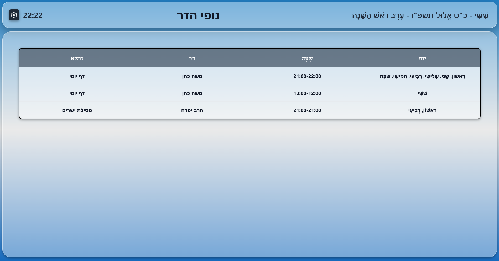
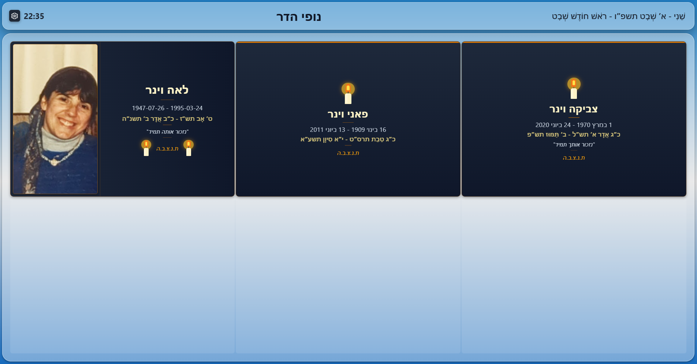
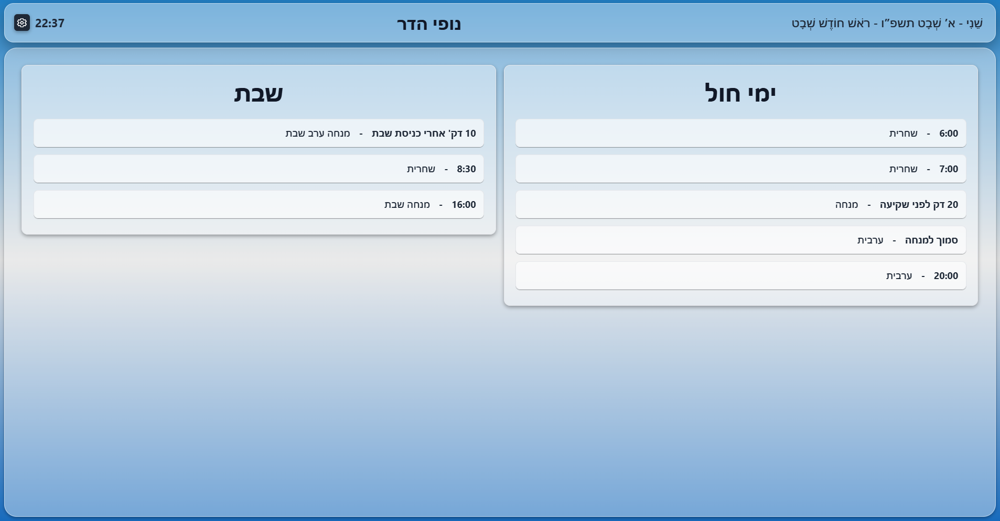

# ✨ Features

## 🕐 Prayer Times & Zmanim

The app provides accurate Zmanim (Jewish prayer times) calculations based on your synagogue's precise location including latitude, longitude, and elevation for maximum accuracy.

### Daily Zmanim Displayed:

- **Alot HaShachar** - Dawn
- **Misheyakir** - Earliest time for Tallit & Tefillin
- **Netz** - Sunrise
- **Kriyat Shema** - Latest time for Shema (both MGA & GRA)
- **Tefila** - Latest time for morning prayer (MGA & GRA)
- **Chatzot Hayom** - Midday
- **Mincha Gedola** - Earliest Mincha
- **Mincha Ketana** - Preferred Mincha time
- **Plag HaMincha** - Plag time
- **Sunset** - Shkiah
- **Nightfall** - Tzait HaKochavim (3 stars)
- **Candle Lighting** - Shabbat and holiday candle lighting times
- **Havdala** - End of Shabbat times (including Rabbeinu Tam)

---

## 📅 Jewish Calendar Integration

Comprehensive Hebrew calendar features with automatic updates:

### Calendar Information:

- **Hebrew Date** - Automatic conversion and display
- **Weekly Parasha** - Torah portion of the week
- **Haftarah** - Prophetic reading
- **Jewish Holidays** - All major and minor holidays
- **Molad** - New moon times
- **Shabbat Mevarchim** - Blessing the new month
- **Omer Count** - Daily Omer count during the counting period

### Special Tefila Indicators:

- **Mashiv HaRuach** - Winter rain prayer (from Shmini Atzeret)
- **Tal Umatar** - Request for rain (from 60 days after Tekufat Tishrei)
- **Morid HaTal** - Summer dew prayer
- **Veten Bracha** - Blessing prayer
- **Al HaNisim** - Thanksgiving prayer (Chanukah, Purim)
- **Yaale VeYavo** - Holiday prayer insertions

### Special Day Indicators:

- **Hallel** - Full or half Hallel days
- **Tachanun** - Days when Tachanun is omitted (all day or specific prayers)
- **Fast Days** - Fast start and end times
- **Purim** - Regular Purim or Shushan Purim

---

## 📚 Classes & Learning Schedule

Organize and display your synagogue's learning schedule (Shiurim).

### Features:

- **Day-based Organization** - Group classes by day of the week
- **Teacher/Rabbi Names** - Display who's teaching
- **Subject/Topic** - What's being taught
- **Time Management** - Set specific times for each class
- **Enable/Disable** - Toggle the entire classes page on/off
- **Easy Management** - Add, edit, or remove classes anytime

### Use Cases:

- Daily Daf Yomi sessions
- Weekly Parasha classes
- Halacha shiurim
- Women's learning groups
- Youth programs

---

## 📢 Messages & Announcements

Keep your community informed with time-based announcements.

### Features:

- **Custom Messages** - Add any text announcement
- **Time-based Display** - Set start and end times for messages
- **Multiple Messages** - Display several announcements simultaneously
- **Easy Management** - Add, edit, or delete messages
- **Enable/Disable** - Toggle the messages page on/off

### Use Cases:

- Mazal Tov announcements
- Community events
- Schedule changes
- Important notices
- Holiday greetings

---

## 🕯️ Memorial Page (Yahrzeit)

Honor the memory of departed community members with a dedicated memorial page.

### Features:

- **Hebrew/English Dates** - Automatic conversion between calendars
- **Photo Support** - Upload photos via imgBB API
- **Multiple Templates:**
  - **Simple** - Text-only display
  - **Card** - Enhanced card layout with borders
  - **Photo** - Prominent photo display
- **Gender-aware** - Proper Hebrew grammar (נפטר/נפטרה, נולד/נולדה)
- **Memorial Text** - Optional tribute/biography text
- **Flexible Display:**
  - **Monthly Mode** - Show only this month's yahrzeits
  - **All Year Mode** - Display all entries
- **Customizable Layout** - Configure grid rows and columns
- **Default Template** - Set a default template for all entries

### Configuration:

- Individual template per person (or use default)
- Table layout customization
- Photo URL or upload
- Birth and death dates (Hebrew or English)

---

## ⏰ Prayer Schedule

Create and display custom prayer time schedules.

### Features:

- **Multiple Columns** - Separate schedules for:
  - Regular weekdays
  - Shabbat/Holidays
  - Special occasions
- **Unlimited Prayers** - Add as many prayer times as needed
- **Prayer Names** - Custom names for each service (Shacharit, Mincha, Maariv, etc.)
- **Specific Times** - Exact times for each prayer
- **Easy Editing** - Modify or delete any entry
- **Enable/Disable** - Toggle the schedule page on/off

### Use Cases:

- Different minyan times for weekdays vs. Shabbat
- Multiple minyanim throughout the day
- Special holiday schedules
- Seasonal time changes

---

## 🎨 Customization & Appearance

Make the display uniquely yours with extensive customization options.

### Background Options:

#### 1. Image Backgrounds

- 4 pre-included beautiful backgrounds
- Upload your own images
- Perfect for creating a branded look

#### 2. Solid Colors

- Choose any solid color
- Clean, professional appearance
- Great for high-contrast displays

#### 3. Gradient Backgrounds

- Create beautiful color transitions
- Multiple color stops (add/remove colors)
- Direction options:
  - Vertical
  - Horizontal
  - Diagonal
- Custom color picker for each stop

### Display Options:

- **Language Toggle** - Switch between Hebrew and English
- **Responsive Design** - Works on all screen sizes
- **Layout Configuration** - Adjust grid layouts for different displays

---

## ☁️ Cloud Sync (Optional)

GitHub Gist integration for settings backup and multi-device synchronization.

### Why Use Cloud Sync?

- **Multi-device Support** - Update from any device, sync everywhere
- **Backup Safety** - Never lose your configuration
- **Easy Updates** - Change settings from phone, tablet, or computer

### Important Notes:

- ✅ **Completely Optional** - App works perfectly without it
- ✅ **Private & Secure** - Uses private GitHub Gists
- ✅ **Free** - GitHub Gists are free
- ✅ **No Account Needed** - Only if you want sync functionality

### What Gets Synced:

- All settings and configurations
- Classes schedule
- Messages
- Memorial entries
- Prayer schedules
- Background preferences
- Location settings

[📖 Setup Guide](./GITHUB_SETUP.md)

---

## 🌍 Internationalization

Full bilingual support for Hebrew and English.

### Features:

- **Complete Translation** - Every text element translated
- **RTL Support** - Proper right-to-left display for Hebrew
- **Date Formatting** - Culture-appropriate date formats
- **Number Formatting** - Localized number display
- **Easy Switching** - Toggle language in settings

### Translation Coverage:

- User interface
- Settings screens
- Error messages
- Help documentation
- Calendar terms (Hebrew calendar names)
- Prayer names (Zmanim)

---

## 📱 Platform Support

Built with React Native and Expo for maximum compatibility.

### Supported Platforms:

- **Android** - Phones, tablets, TV boxes
- **iOS** - iPhone, iPad
- **Web** - Any modern browser
- **Progressive Web App** - Installable web version

### Responsive Design:

- Automatically adapts to screen size
- Portrait and landscape orientation support
- Touch and mouse input
- Keyboard navigation support

---

## 🔒 Privacy & Security

Your data stays with you.

### Privacy Features:

- **Local Storage** - All data stored on your device
- **No Tracking** - No analytics or tracking
- **No Ads** - Completely ad-free
- **Optional Cloud** - You control if/when to use cloud backup
- **Open Source** - Audit the code yourself

### Security:

- Private GitHub Gists (if using sync)
- Secure API key authentication
- No sensitive data exposed
- GPL-2.0 License

---

## ♿ Accessibility

Designed to be usable by everyone.

### Accessibility Features:

- High contrast mode support
- Readable font sizes
- Touch-friendly interface
- Keyboard navigation
- Screen reader compatible
- Simple, clear layout

---

[⬅️ Back to Main README](../README.md)
