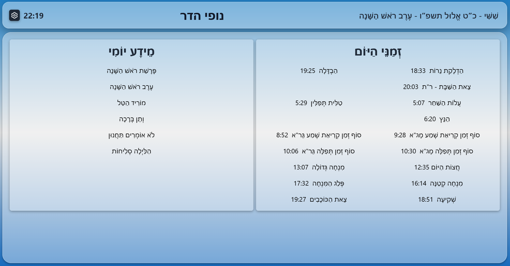
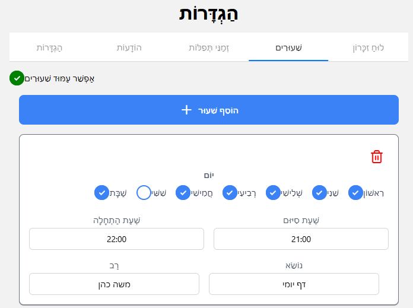

<div dir="rtl">

# 🕍 לוח שנה לבית הכנסת

<div align="center">


**פתרון לוח שנה דיגיטלי מקיף לבתי כנסת**

[🌐 **הדגמה חיה**](https://rafiw.github.io/synagogue-calendar/) | [עברית](#עברית) | [English](../README.md)

</div>

---

## 📋 קישורים מהירים

- [תכונות](./FEATURES.md) 📖
- [התקנה](./INSTALLATION.md) 🚀
- [מדריך פריסה](./DEPLOYMENT.md) 📦
- [הגדרת גיבוי GitHub](./GITHUB_SETUP.md) 🔄
- [תרומת קוד](./CONTRIBUTING.md) 🤝

## 📖 אודות

לוח שנה לבית הכנסת הוא אפליקציה מודרנית וחינמית, שנועדה לעזור לבתי כנסת לנהל ולהציג על מסך טלויזיה מידע רלוונטי למתפלל כולל זמני תפילה, שיעורים, הודעות ומידע אודות נפטרים.
ניתן לבחור מה להציג.

האפליקציה בנויה עם React Native ו-Expo, ופועלת בצורה חלקה על פלטפורמות Android, ודפדפן אינטרנט.



## ✨ תכונות עיקריות

- 🕐 **זמנים מדויקים** - זמני תפילה מדויקים על בסיס מיקום
- 📅 **לוח עברי** - אינטגרציה אוטומטית עם פרשה, חגים וימים מיוחדים
- 📚 **שיעורים ולימוד** - ניהול לוחות שיעורים
- 📢 **הודעות** - הצגת הודעות מבוססת זמן
- 🕯️ **לוח זיכרון** - הצגת לוח הנצחה דיגיטלי
- ⏰ **לוח תפילות** - הצגת זמני תפילה הניתנת להתאמה
- 🎨 **התאמה אישית יפה** - רקעי תמונה, צבעים אחידים או גרדיאנטים
- 🌍 **דו-לשוני** - תמיכה מלאה בעברית ובאנגלית
- ☁️ **סנכרון ענן אופציונלי בחינם** - גיבוי GitHub Gist לסנכרון בין מכשירים

[👉 ראה את כל התכונות בפירוט](./FEATURES.md)

## 🚀 התחלה מהירה

```bash
# שכפול הריפוזיטורי
git clone https://github.com/yourusername/synagogue-calendar.git
cd synagogue-calendar

# התקנת תלויות
yarn install

# הפעלת שרת הפיתוח
yarn start
```

[📖 מדריך התקנה מלא](./INSTALLATION.md)

## 📦 פריסה

פריסה למספר פלטפורמות:

- **🌐 אינטרנט** - Netlify, Vercel, GitHub Pages, או כל שרת אינטרנט
- **📱 אנדרואיד** - APK דרך EAS Build או Android Studio
- **🍎 iOS** - App Store דרך EAS Build או Xcode

[📖 מדריך פריסה מלא](./DEPLOYMENT.md)

## ⚙️ הגדרות

1. **הגדר מיקום** - קבע איזור זמן, קו רוחב, קו אורך לזמנים מדויקים - ניתן להיעזר בגוגל מפות
2. **התאם מראה** - בחר רקעים, צבעים ופריסה
3. **הוסף תוכן** - הגדר שיעורים, הודעות, רשומות זיכרון ולוחות תפילה
4. **גיבוי אופציונלי** - הגדר GitHub Gist לסנכרון ענן

האפליקציה עובדת בצורה מושלמת ללא כל גיבוי בענן. אינטגרציית GitHub היא אופציונלית ומאפשרת סנכרון הגדרות בין מספר מכשירים.

[📖 מדריך הגדרת גיבוי GitHub](./GITHUB_SETUP.md)

## 🤝 תרומת קוד

אנו מזמינים תרומות ממפתחים! בין אם אתה מתקן באגים, מוסיף תכונות, משפר תיעוד או מוסיף תמיכה בשפות נוספות - עזרתך מוערכת.

[📖 הנחיות תרומה](./CONTRIBUTING.md)

## 📱 צילומי מסך

<div align="center">

|            הודעות             |              הגדרות              |              שיעורים              |
| :---------------------------: | :------------------------------: | :-------------------------------: |
|  |  |  |

|            לוח זיכרון            |          לוח תפילות           |         אפשרויות רקע          |
| :------------------------------: | :---------------------------: | :---------------------------: |
|  |  |  |

</div>

## 📄 רישיון

פרויקט זה מורשה תחת GNU General Public License v2.0 - ראה קובץ [LICENSE](../LICENSE) לפרטים.

## לעילוי נשמת

- פרויקט זה נכתב לעילוי נשמת:
- אבי יעקב וינר שהיה גבאי שנים עשרות שנים בבית כנסת מורשת הראה
- אימי לאה וינר שאיבדתי אותה בגיל צעיר אבל זיכרה ניכר עלי עד ימים אלה
- סבתי ציפורה פאני שגידלה אותי כמו בן
- אחי צבי וינר

## 💝 תמיכה

אם אתה מוצא פרויקט זה מועיל:

- ⭐ תן כוכב לריפוזיטורי
- 🐛 דווח על באגים
- 💡 הצע תכונות
- 🔀 תרום קוד
- 📖 שפר תיעוד

## 📞 יצירת קשר

לשאלות, הצעות או תמיכה, אנא פתח issue ב-GitHub.

## 🙏 תודות

- [Hebcal](https://www.hebcal.com/) עבור חישובי לוח השנה העברי
- קהילות React Native ו-Expo
- כל התורמים והמשתמשים

---

<div align="center">

**נוצר באהבה עבור הקהילה היהודית ❤️**

</div>

</div>
